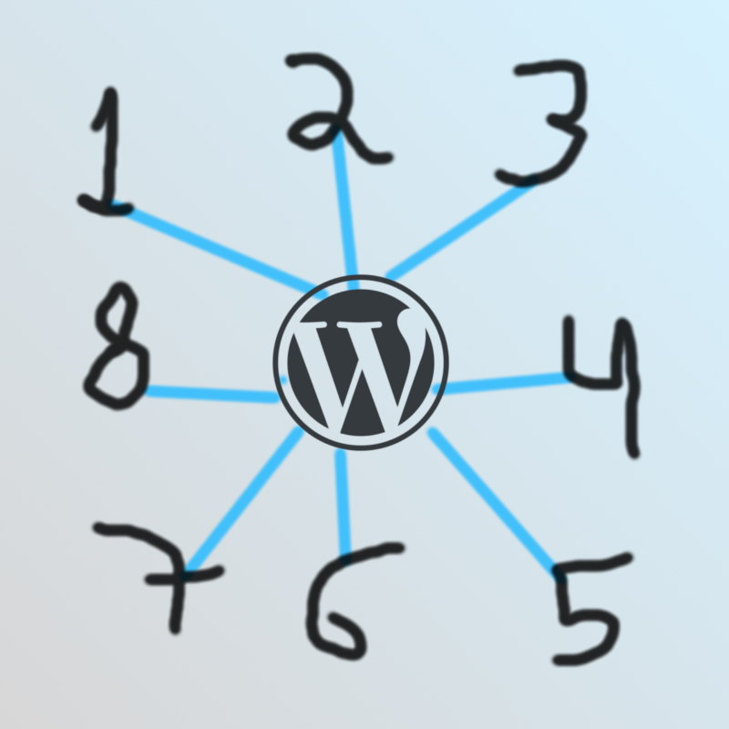

# F5 Sites Shared Posts Tables and Uploads Folder
by Francisco Mat

Hacks WordPress databases, sharing posts and taxonomies tables for multiple wp install under the same database, by default wp only can share tables users and usermeta. Made for use in fnetwork.

